### Course: Software Development - V 
### Semester: 3.2
---
# 🍔 Foodie

Foodie is a web-based food ordering and management system developed using **ASP.NET**. The project is designed to provide a simple and efficient platform where users can browse food items, place orders, and manage food-related activities digitally. It is suitable for academic projects as well as a foundation for real-world food delivery applications.

---

## 🚀 Features

* User-friendly web interface
* Food item listing and browsing
* Order placement functionality
* Secure and structured backend using ASP.NET
* IIS Express support for local development
* Debug and development-friendly configuration

---

## 🛠️ Technologies Used

* **ASP.NET** (Web Application)
* **C#**
* **Visual Studio**
* **IIS Express** (for local hosting)
* **HTML, CSS, JavaScript** (frontend)
* **MSBuild** project structure

---
username: Admin ||
password: 123
---

## 📂 Project Structure (Overview)

```
Foodie
│
├── Controllers/        # Handles request logic
├── Models/             # Data models
├── Views/              # UI pages
├── wwwroot/            # Static files (CSS, JS, images)
├── Foodie.csproj       # Project configuration
└── README.md           # Project documentation
```
## UI Interface
**Dashboard**


**Our Category**
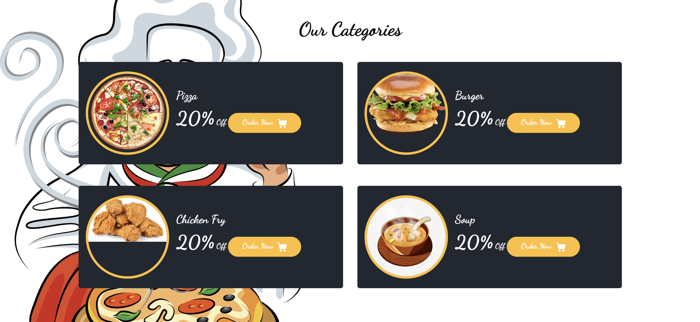

**About**
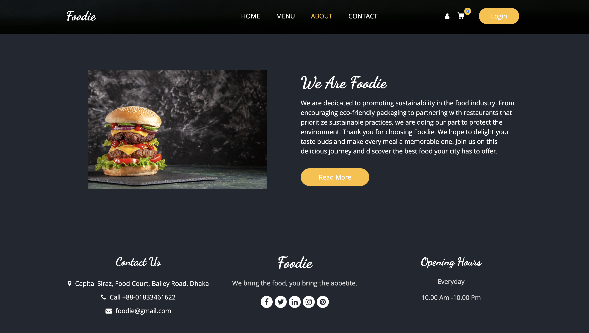

**Contact**
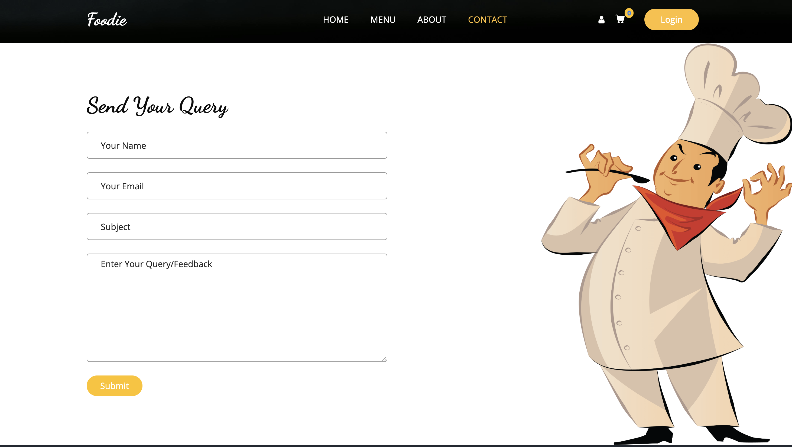

**Registration**
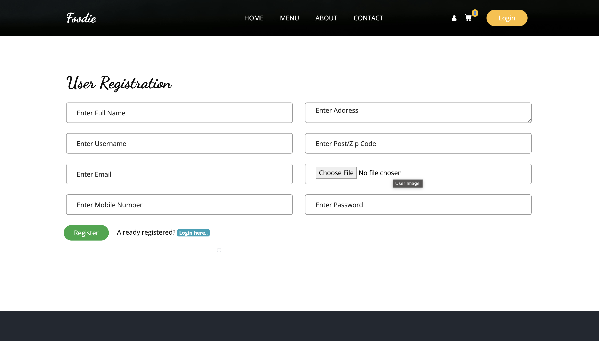

**Login**
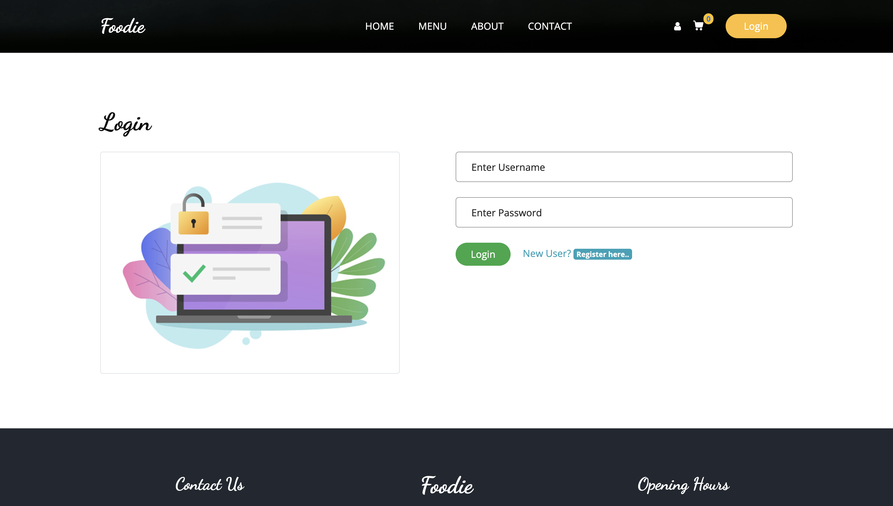

**User**
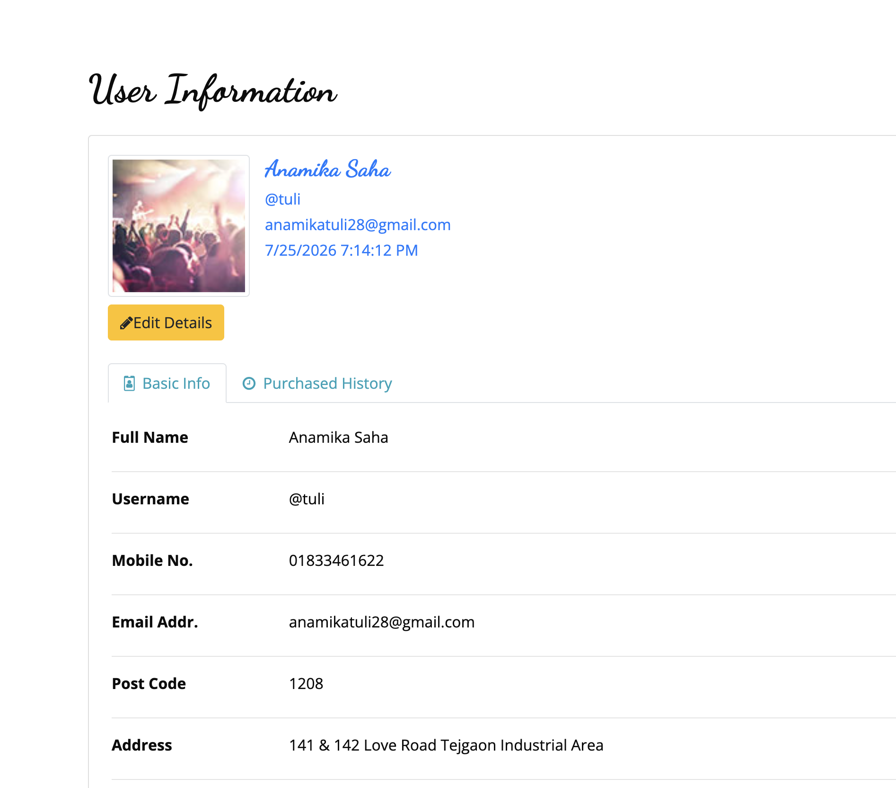

**Menu**
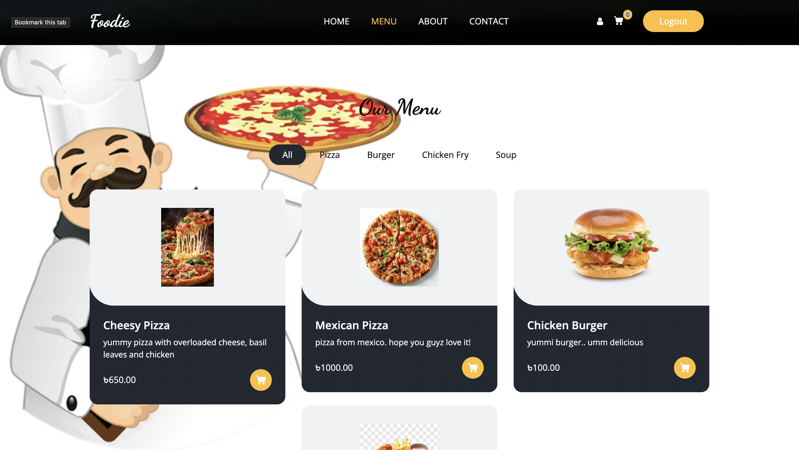

**Shopping Cart**
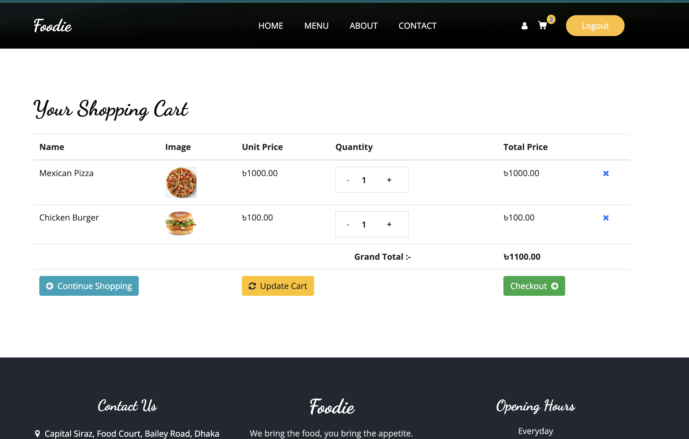

**Payment**
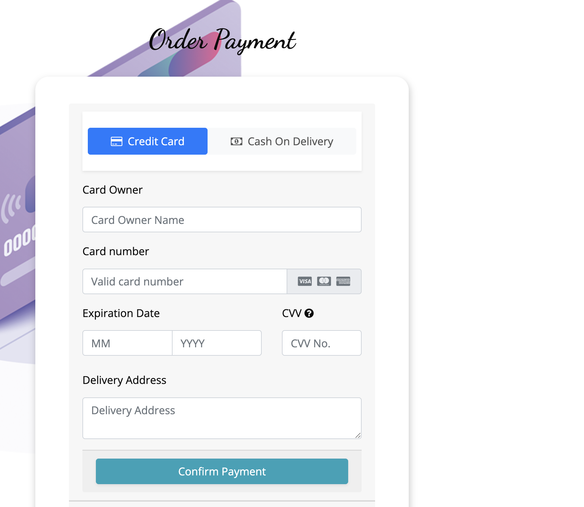

**Invoice**
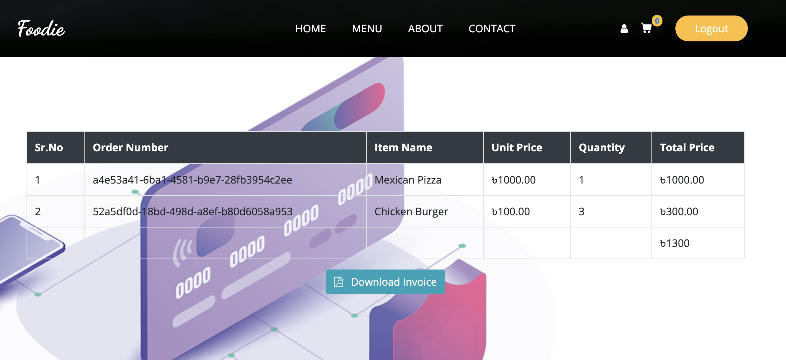

**Admin-Dashboard**
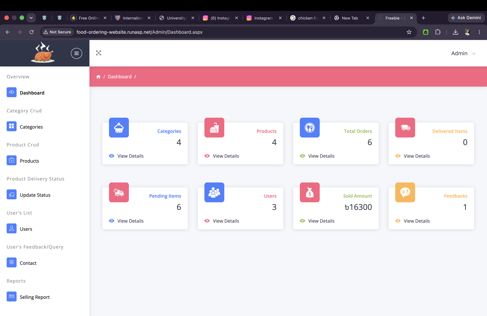

**Admin- Category**
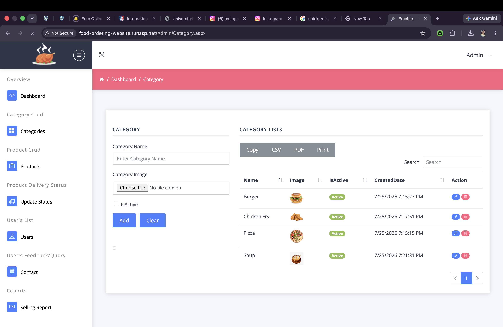

**Admin- Product**
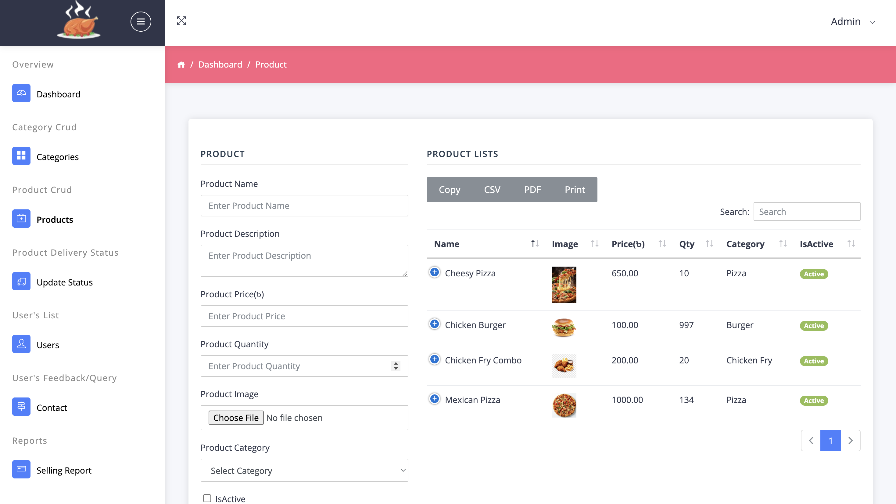

**Update Status**
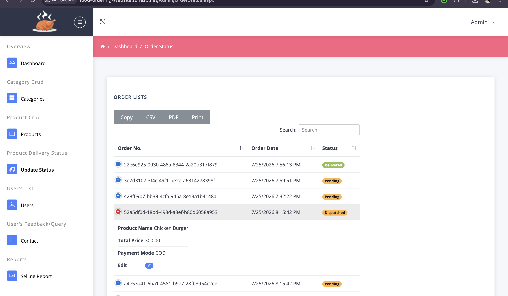

**Admin- Users**
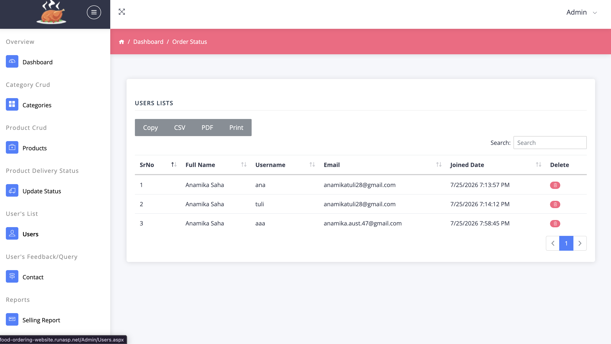

**Contact**
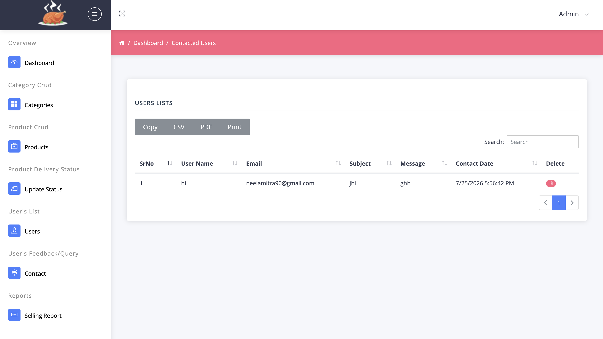

**Selling Report**
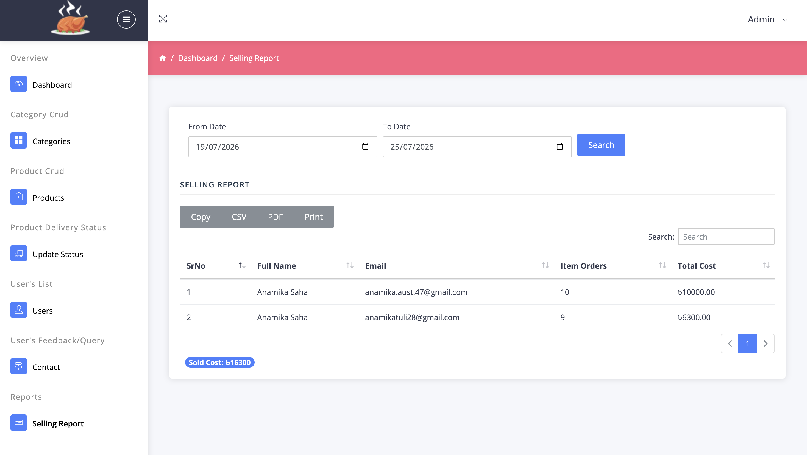


---

## ⚙️ Setup & Installation

Follow the steps below to run the project locally:

1. **Clone the repository**

   ```bash
   git clone https://github.com/anaTuli133/FoodBazar.git
   ```

2. **Open the project**

   * Open `Foodie.sln` using **Visual Studio**

3. **Restore dependencies**

   * Visual Studio will automatically restore required NuGet packages

4. **Run the project**

   * Press `Ctrl + F5` or click **Run**
   * The application will start using **IIS Express**

5. **Access in browser**

   ```
   https://localhost:44332/
   ```

---

## 🧪 Development Notes

* IIS Express is enabled for debugging
* SSL is configured for local development
* Debug mode is turned on for easier testing

---

## 📌 Use Cases

* Academic / University project
* Practice project for ASP.NET learners
* Base template for food ordering systems

---

## 🔒 Security

* Runs on HTTPS (local SSL)
* Authentication and authorization can be extended as needed

---

## 📈 Future Enhancements

* User authentication & role management
* Online payment integration
* Admin dashboard for food management
* Order tracking system
* Database optimization

---

## 👩‍💻 Author

**Anamika Saha** |
Department of Computer Science & Engineering

---

## 📄 License

This project is for educational purposes. You are free to modify and use it as needed.

---

⭐ If you like this project, don’t forget to give it a star on GitHub!
